### game design


### spring joint

spring joint lets us attach a 2d game object with a collider to an invisible pivot point. it will swing.

step 1 - make a static sprite (one that doesn't move)


step 2 - name it pivot


step 3 - remove the collider component on it so nothing collides with it

step 4 - for our purposes change it from a circle to a square. Click the circle thing to choose a new Sprite in the Sprite row of the Sprite Renderer Component and search for circle


### creating a 2d ball with physics that bounces

unity adds a sprite renderer, 2d collider and rigid body onto the circle


make a square, stretch it and give it a collider. it doesn't need a rigidbody.


now make a 2d physics material in your assets folder


without doing this next step, the ball will stop when it hits the floor


### test on different devices from the unity editor

nothing beats testing on the phone though


### definitely use the input system package

tricks unity into thinking mouse clicks are actually touch inputs on the screen

this way in our code we don't have to say if using mouse do this, if using touch, do this

so whether we're using the editor or our phone, it'll work the same

step 1


step 2


step 3


### canvas (UI in Unity)

The Canvas is the area that all UI elements should be inside. The Canvas is a Game Object with a Canvas component on it, and all UI elements must be children of such a Canvas.

The Canvas area is shown as a rectangle in the Scene View. This makes it easy to position UI elements without needing to have the Game View visible at all times.

UI elements in the Canvas are drawn in the same order they appear in the Hierarchy. The first child is drawn first, the second child next, and so on. If two UI elements overlap, the later one will appear on top of the earlier one.

To change which element appear on top of other elements, simply reorder the elements in the Hierarchy by dragging them. The order can also be controlled from scripting by using these methods on the Transform component: 

* SetAsFirstSibling
* SetAsLastSibling
* SetSiblingIndex

The Canvas has a **Render Mode setting** which can be used to make it render in **screen space** or **world space.**

**World Space**
In this render mode, the Canvas will behave as any other object in the scene. The size of the Canvas can be set manually using its Rect Transform, and UI elements will render in front of or behind other objects in the scene based on 3D placement. This is useful for UIs that are meant to be a part of the world. This is also known as a “diegetic interface”.

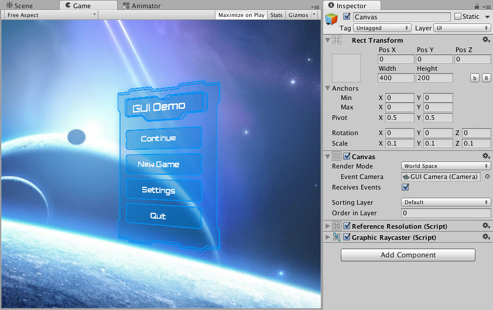

**Screen Space - Overlay**
This render mode places UI elements on the screen rendered on top of the scene. If the screen is resized or changes resolution, the Canvas will automatically change size to match this.

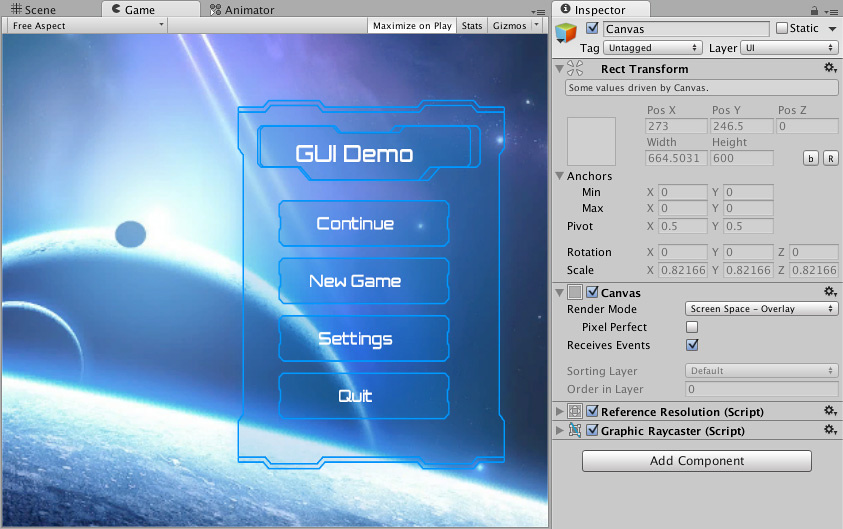

**Screen Space - Camera**
This is similar to Screen Space - Overlay, but in this render mode the Canvas is placed a given distance in front of a specified Camera
. The UI elements are rendered by this camera, which means that the Camera settings affect the appearance of the UI. If the Camera is set to Perspective, the UI elements will be rendered with perspective, and the amount of perspective distortion can be controlled by the Camera Field of View. If the screen is resized, changes resolution, or the camera frustum changes, the Canvas will automatically change size to match as well.

There are two types of camera views in game development, Perspective (objects are smaller the farther away they are) and orthographic (all objects are the same size no matter the distance)
So when you have a Screen Space Camera set to perspective, you have UI elements that can have distance from the camera.  

This would be handy if you wanted to have say 3D elements in a UI space or like the example on the Unity article there a rotated canvas


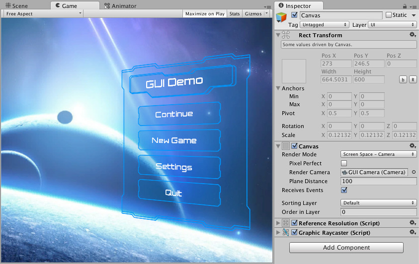

**canvas scaler**

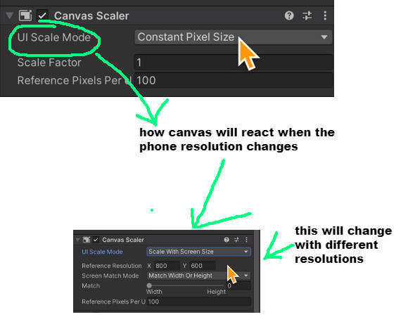
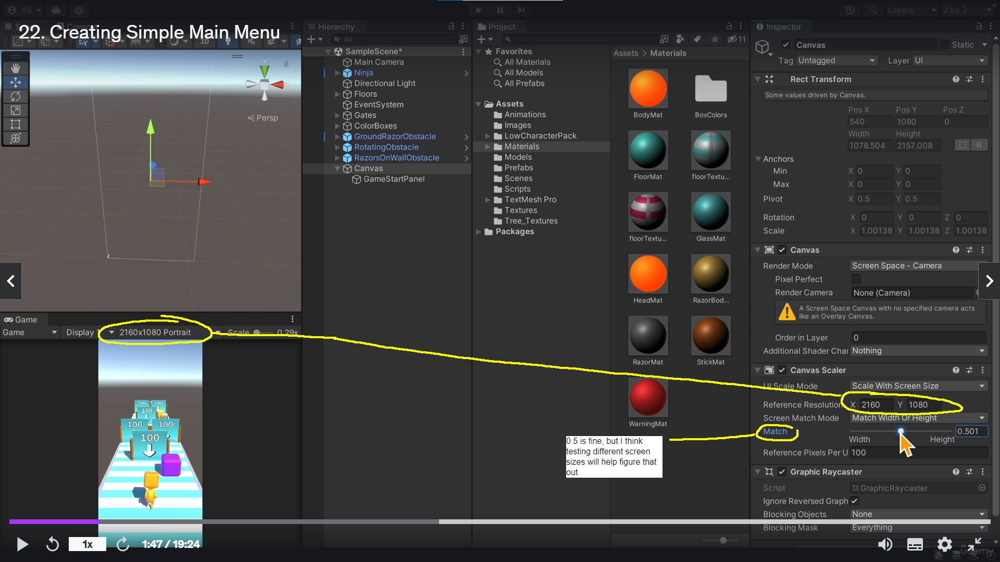

**auto size** - for text ui elements in the canvas - it makes the font size adapt to the screen size


**make a ui element in the canvas stretch across it**


**trigger function on button click**


### how-to-make-a-singleton


### OnTriggerEnter-script-needs-to-be-on-GO-with-box-collider NOT the parent object

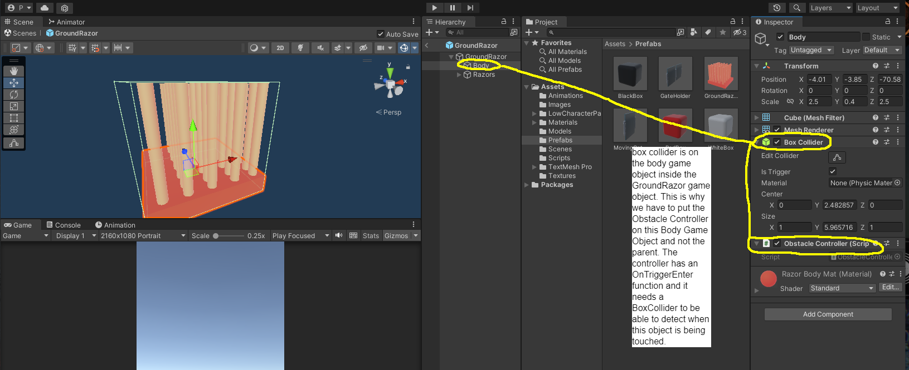

### access the transform component of a game object

by simply writing ```transform``` in a c# script that happens to be a component on a game object

I can modify the transform component of a game object in the c# code in the following ways:

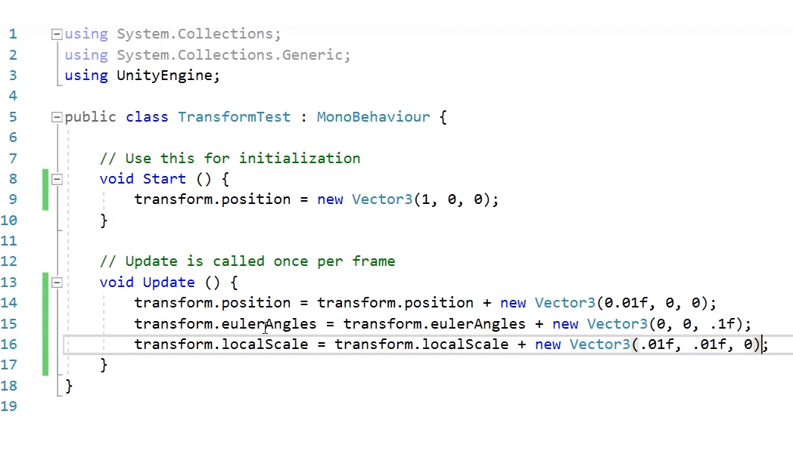

above code from https://www.youtube.com/watch?v=8pC3SE5PIzY

### destroy the game object

```
Destroy(gameObject);
```

so if the class that this code is in, is added as a component it will kill the object it's on

this is why you shouldn't name GameObjects, gameObject. 

### how to quickly tell that a game object is a prefab from the hierarchy window

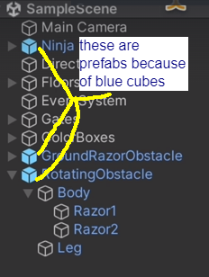

### set default animation

go into the animation controller and right click a state and set it as "Set as Layer Default State"


### record game objects being moved and turn them into animations with a recorder

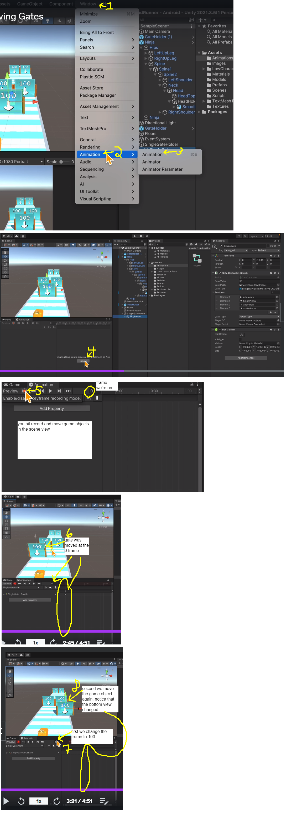

### edit a keyframe of an animation already made

make sure the recorder is on when editing a keyframe

you can select the exact keyframe by hitting the fast forward and rewind buttons

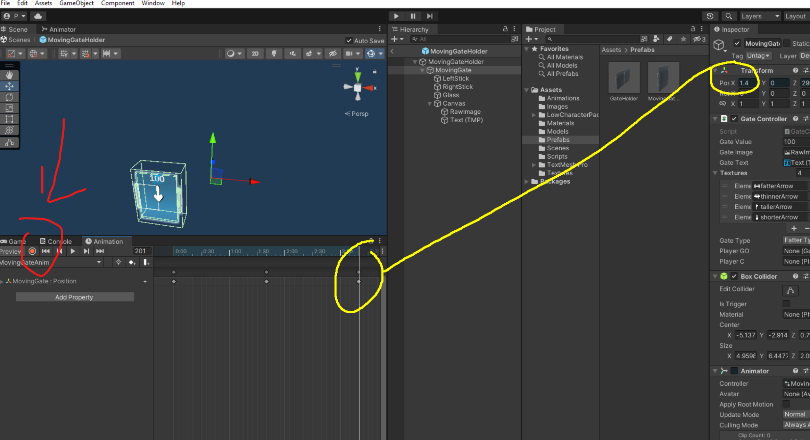

### how to detect two game objects touching

if both have colliders and one has a rigid body then we can detect the touch

then you can detect the collision using OnTriggerEnter

### turning-image-into-sprite.png

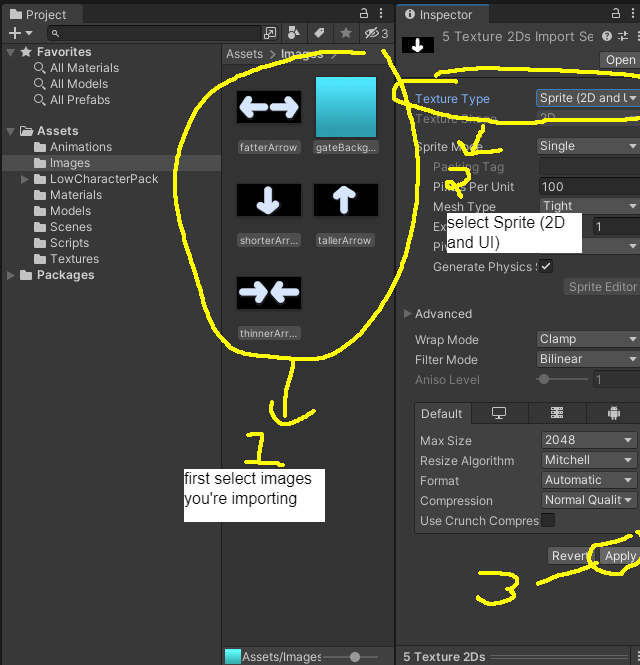

### freeze-rotation.png

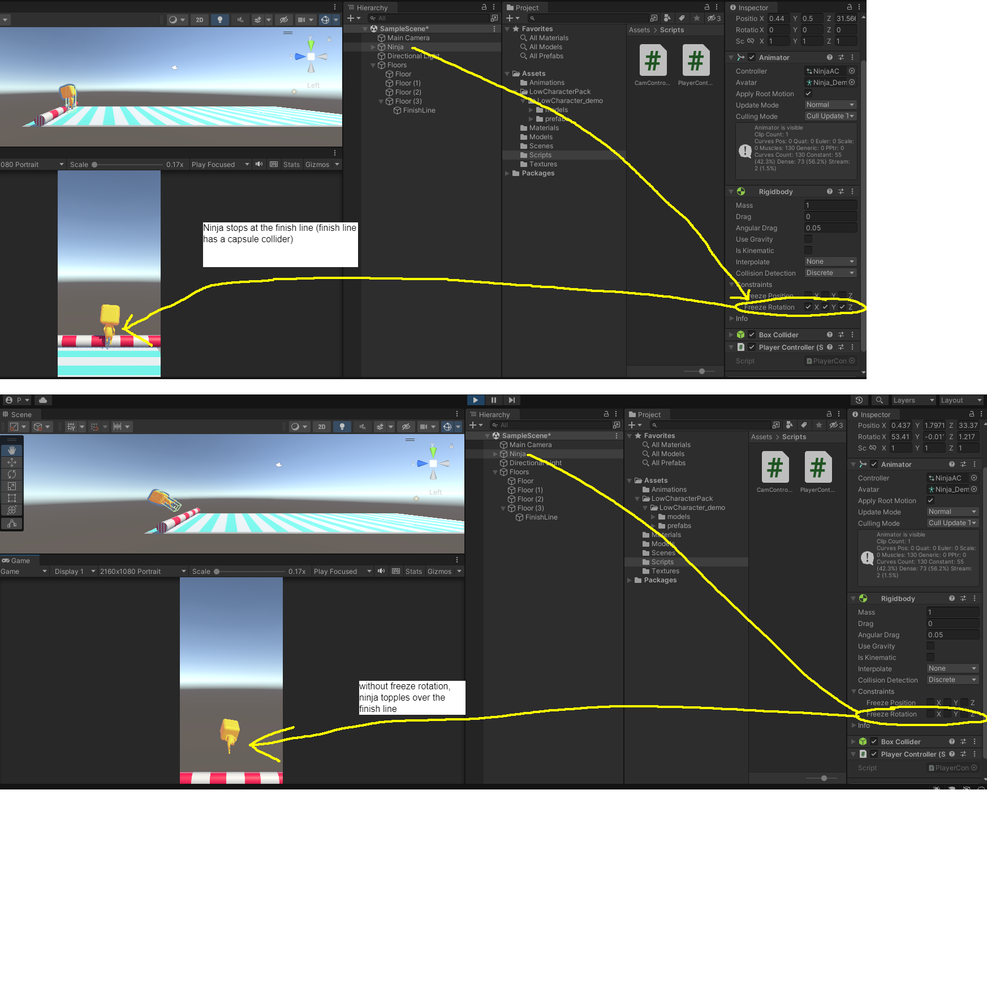

### switch-dim-views-in-3d-space.png

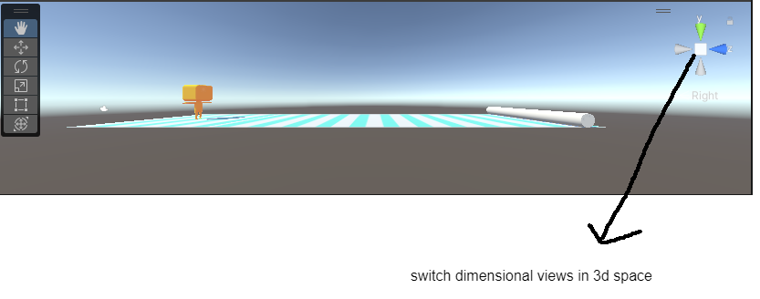

### using assets from unity asset store

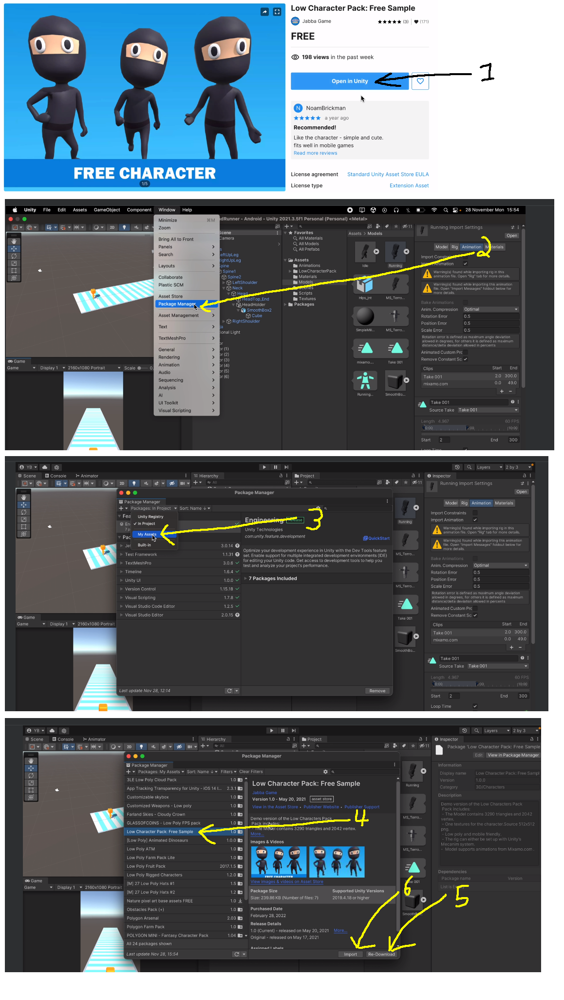

### on windows hold left alt while hand tool is selected to rotate around

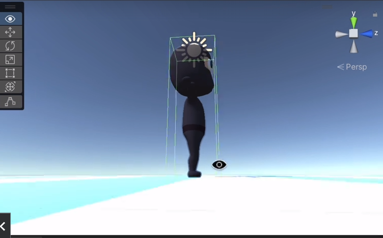

### track collisions without blocking them (trigger)

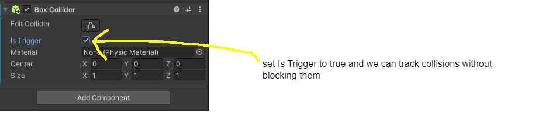

### apply changes to a prefab
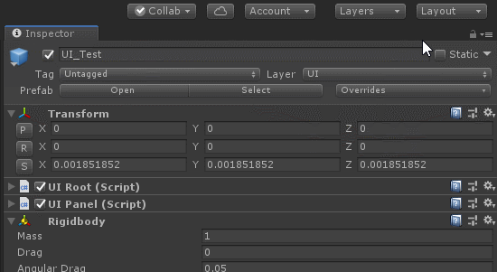

### instantiate a prefab

the prefab has to be in a Resources folder, named exactly like that.

Resources.Load

Loads the asset of the requested type stored at path in a Resources folder.

This method returns the asset at path if it can be found, otherwise it returns null.

Note that the path is case insensitive and must not contain a file extension. All asset names and paths in Unity use forward slashes, so using backslashes in the path will not work.

You must store your asset in a Resources folder. 

the path you pass to Resources.Load will be relative to the root of the closest Resources folder. 

For example, if you have an asset at:

Assets\MyGame\Models\Resources\Category1\SomeModel

You will load it like this:

Resources.Load("Category1\SomeModel")

Specific example where you create 6 prefabs in front of the player but spaced out

    obstacle = Resources.Load<GameObject>("ObstacleObject");
    playerTransform = GameObject.FindWithTag("Player").GetComponent<Transform>(); //Every object in a Scene has a Transform. It's used to store and manipulate the position, rotation and scale of the object. Every Transform can have a parent, which allows you to apply position, rotation and scale hierarchically. 
    
    for(int i = 0; i < 5; i++){
        //Quaternion does rotations, has a w value in addition to x,y,z
        //we have it so it'll rotate to the right direction so it'll be pointed to the player
        Instantiate(obstacle, playerTransform.position + Vector3.forward * (60 + i * 60), Quaternion.Euler(0, 90, 0)); //increase the second 60 to make it easier and lessen it to make it harder. it's the distance between each obstacle. less is hard. more is easier.
    }


### rigidbody z axis motion

the game object has to have rigidbody compocomponent added to it from the unity ui

    void Start()
    {
        rb = GetComponent<Rigidbody>();
        rb.velocity = Vector3.forward * 20; //Vector3.forward is the same as 0, 0, 1
    }

### Input.GetAxisRaw("Horizontal"); 

track the sphere when it's continuously being pressed, returns a value. getAxis returns -1, 0 or 1 (good if you want to do all the smoothing of keyboard input yourself)

    // horizontalInput = Input.GetAxisRaw("Horizontal");
    // verticalInput = Input.GetAxisRaw("Vertical");

### Input.GetKeyDown("d")

does not track the sphere when it's continuously being pressed, returns true/false. Returns true during the frame the user starts pressing down the key identified by name.

Call this function from the Update function, since the state gets reset each frame. It will not return true until the user has released the key and pressed it again.

    horizontalInput = ((Input.GetKeyDown("d") ? 1 : 0) + (Input.GetKeyDown("a") ? -1 : 0));
    verticalInput = ((Input.GetKeyDown("w") ? 1 : 0) + (Input.GetKeyDown("s") ? -1 : 0));

### Time.deltaTime;

0.000001 time between each frame. this varies based on how fast your system is. slow system will be bigger deltaTime. fast system will be smaller deltaTime

### horizontal movement for 3d obj

    if (horizontalInput != 0)
    {
        rb.velocity = new Vector3(horizontalInput * 6, rb.velocity.y, rb.velocity.z);
    }

### vertical movement for 3d obj

    if (verticalInput != 0)
    { //if up or down is pressed then enter this if
        rb.velocity = new Vector3(rb.velocity.x, verticalInput * 5, rb.velocity.z);
    }

### detect swipes for mobile

https://docs.unity3d.com/ScriptReference/TouchPhase.html

Began	A finger touched the screen.
Moved	A finger moved on the screen.
Stationary	A finger is touching the screen but hasn't moved.
Ended	A finger was lifted from the screen. This is the final phase of a touch.
Canceled	The system cancelled tracking for the touch. at least one finger on the screen

    //at least one finger on the screen
    if (Input.touches.Length > 0)
    {
        Debug.Log("Input.touches.Length " + Input.touches.Length);

        //only use first touch of input
        Touch touch = Input.GetTouch(0);
        if (touch.phase == TouchPhase.Began)
        {
            startPosition = touch.position; //grab the position when the player touches the screen
            Debug.Log("startPosition " + startPosition);
        }else if (touch.phase == TouchPhase.Ended || touch.phase == TouchPhase.Canceled)
        {
            startPosition = Vector2.zero; //reset it after the swipe is done
        }
        else if (touch.phase == TouchPhase.Moved)
        {
            deltaSwipe = Vector2.zero; //reset the deltaSwipe

            if (startPosition != Vector2.zero)
            {
                //get how long the swipe currently is
                deltaSwipe = touch.position - startPosition;
            }

            //get the length of the vector with sqrMagnitude. It's faster to do it this way based on unity docs
            if (deltaSwipe.sqrMagnitude > 5000)
            {
                //get direction of swipe
                float x = deltaSwipe.x;
                float y = deltaSwipe.y;

                // if x is larger then horizontal movement 
                if (Mathf.Abs(x) >= Mathf.Abs(y)) //we prefer the x axis when they're equal
                {
                    if (x > 0)
                    { // right
                        horizontalInput = 1;
                    }
                    else //left
                    {
                        horizontalInput = -1;
                    }
                }
                else
                {//d if y is larger then vertical movement
                    if (y > 0)
                    { // up
                        verticalInput = 1;
                    }
                    else //down
                    {
                        verticalInput = -1;
                    }
                }
                startPosition = deltaSwipe = Vector2.zero;
            }
        }
    }
### test on phone while coding

install unity Remote on your android phone

connect android phone to computer

in Unity -> Edit -> Project Settings -> Editor -> Device -> Any Android Device

set build settings to android -> File -> Build Settings -> Android -> Switch Platform 

save Unity

restart Unity 

Press Play
